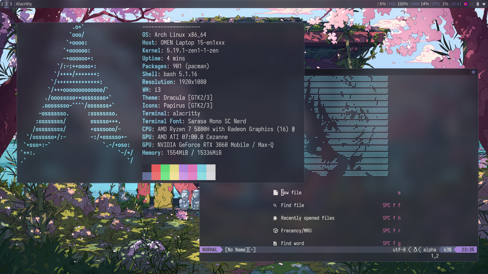

# ❄️ Dotfiles & NixOS Configurations

> *Declarative systems, modular user environments, and reasonable defaults.*



## Overview

This repository is primarily centered around a **declarative, multi-host NixOS configuration** utilizing Flakes, coupled with [Chezmoi](https://www.chezmoi.io/) for managing imperative user-space dotfiles across different platforms.

## ❄️ NixOS Architecture (The Core)

The `flake/` directory is the heart of this repository. It defines immutable, reproducible system environments for a variety of hardware architectures and deployment targets.

### Highlights & Inputs
- **Secret Management**: Utilizes `sops-nix` to safely store and deploy secrets.
- **Declarative Partitioning**: Integrated with `disko` for automated disk formatting and partitioning.
- **Hardware Support**: Uses `nixos-hardware` for sane defaults across specific devices.
- **Generators**: Employs `nixos-generators` for building custom ISOs and Raspberry Pi images (`isolive`, `rpi-image`).

### Supported Hosts
The Flake exports configurations for multiple machines:
- **`omen15`**: Primary laptop/desktop system configuration.
- **`rpi4-side-gateway` & `rpi4-switch`**: Network infrastructure routing on Raspberry Pi 4.
- **`oci`**: Headless server configuration for Oracle Cloud Infrastructure instances.

### Modularity & Deep Dive (`flake/modules/`)

The `flake/modules` directory contains a highly modular, deeply optimized, and secure NixOS configuration stack. The architecture is split between **Base Profiles** (core system definitions based on device roles) and **Feature Modules** (opt-in capabilities ranging from complex proxy stacks to eBPF scheduling).

#### Base System Profiles

*   **`core.nix`**: The foundational layer for all machines. It configures modern terminal utilities (`zsh`, `direnv`, `nh`, `fzf`, `btop`, `yazi`), Nix settings (Flakes, Caches, Auto-GC), and robust timekeeping via Chrony with NTS (Network Time Security) support against trusted servers (GrapheneOS, Cloudflare). It also includes SMART disk monitoring.
*   **`desktop.nix`**: Optimized for desktop responsiveness. Uses the `preempt=full` kernel parameter and heavily tunes VM sysctls (`vm.swappiness=180`, `dirty_ratio=10`). It configures XDG portals, Polkit via KDE agent, PipeWire for audio, Vulkan/OpenGL acceleration, and includes an intelligent NetworkManager dispatcher script (`gaming-sqm`) that dynamically applies the CAKE qdisc via `tc` to mitigate bufferbloat on Ethernet and Wi-Fi interfaces.
*   **`server.nix`**: Optimized for throughput. Uses `preempt=voluntary`, enables `tuned` (with the `throughput-performance` profile), `fail2ban`, and `irqbalance`. It features a similar but server-tailored CAKE SQM networking script with NAT rules.

#### Security & Hardening (`features/security.nix`)

The security module applies extreme, production-grade hardening across the kernel, user-space, and authentication layers:
*   **Hardware-Backed Authentication**: Mandates FIDO2/YubiKey hardware tokens for PAM authentication (`sudo`, `login`, `sddm`) via `pam_u2f`. SSH is secured using resident `ed25519-sk` keys with password authentication disabled.
*   **Git Commit Verification**: Git is configured to strictly verify commit signatures using SSH Allowed Signers linked to the hardware keys.
*   **Kernel Hardening**: Enforces `lockdown=integrity`, `kcfi` (Control Flow Integrity), `slab_nomerge`, and `randomize_va_space=2`.
*   **Network & Sysctl Hardening**: Mitigates attacks via TCP SYN cookies, RFC1337 (TIME-WAIT Assassination defense), strict ARP filtering, and disables ICMP redirects. IPv6 privacy extensions are enforced.
*   **Memory Safety**: Replaces the standard allocator with `mimalloc` globally for a balance of performance and security. Disables legacy `sudo` entirely in favor of the memory-safe Rust implementation, `sudo-rs`.

#### Advanced Networking & Proxy Stack (`features/proxy.nix`)

A highly intricate, modular proxy routing architecture leveraging `sops-nix` for secret management:
*   **eBPF Transparent Proxy (`dae`)**: Intercepts traffic at the kernel level for maximum performance. Features dynamic routing rules (e.g., directing Chinese traffic to direct via `alih3` DoH3, and private/abroad traffic to `flymc` QUIC).
*   **Universal Proxy (`sing-box`)**: Operates using a FakeIP setup with complex inbound/outbound rules. Integrates heavily with remote SRS rulesets (MetaCubeX) to route traffic intelligently based on domains, GeoIP, and Geosite.
*   **DNS Stack (`dnscrypt-proxy` & `AdGuardHome`)**: Provides secure DNS resolution utilizing DNSCrypt, DoH, and ODoH. Employs a custom blocklist updated via systemd timers and uses customized stamps for zero-trust domains.
*   **Dependency Orchestration**: Ensures deterministic startup ordering via systemd (e.g., `dae` waits for `sing-box` and `AdGuardHome` to initialize).

#### Performance & eBPF Scheduling (`features/performance.nix`)

Focuses on maximizing system throughput, reducing latency, and intelligent resource allocation:
*   **Kernel & Memory**: Enables MGLRU (`lru_gen_enabled=1`), disables `zswap` in favor of `zram` (using `zstd` compression on half of RAM), and aggressively tunes `vm` sysctls for caching and page clustering.
*   **Network Tuning**: Defaults to the BBR TCP congestion control algorithm with optimized buffer sizes (`rmem_max`, `wmem_max`), high `somaxconn`, and TCP Fast Open (3) enabled.
*   **Dynamic Storage Schedulers**: Custom `udev` rules automatically detect drive types and apply the optimal I/O scheduler (NVMe: `none`, SATA/eMMC: `mq-deadline`, HDD: `bfq`), alongside `hdparm` spin-down configurations.
*   **eBPF Process Schedulers (`scx`)**: Leverages `scx_rusty` on x86_64 machines to handle complex process scheduling entirely in user-space via eBPF.

#### Gaming Optimizations (`features/gaming.nix`)

*   **Process Priority**: Utilizes `ananicy-cpp` combined with `ananicy-rules-cachyos` for automatic, rule-based process reprioritization.
*   **Gaming Scheduler**: Switches the eBPF scheduler to `scx_lavd`, which is highly tuned for latency-sensitive interactive tasks and gaming.
*   **Tooling & Networking**: Enables Gamescope (with `capSysNice`), Gamemode, and explicitly opens optimal firewall ports for Steam Remote Play, dedicated servers, and standard game engines (Source, Minecraft).

#### Power Management (`features/powersave.nix`)

*   **Kernel Integration**: Configured for quiet booting, `mem_sleep_default=s2idle`, and active P-State management for both AMD and Intel CPUs.
*   **Dynamic Power Rules**: Advanced `udev` rules toggle audio hardware (`snd-hda-intel`) power-saving capabilities strictly based on battery discharging status to prevent audio popping when plugged in.
*   **Services**: Replaces standard power handlers with `power-profiles-daemon` and implements a custom systemd service wrapping `nbfc-linux` for granular notebook fan control.

#### Utilities, Observability & Virtualisation (`features/utils.nix` & `virtualisation.nix`)

*   **Glance Dashboard**: A profoundly customized, self-hosted dashboard utilizing custom APIs and templates. It integrates:
    *   System monitoring (Uptime Kuma).
    *   Live API pulls (TradingView charts, Steam Top Sellers/Specials, GitHub trending repositories, and real-time Last.fm listening history).
    *   An extensive curated list of RSS feeds (The Guardian, AEON, Economist, etc.) and search engine quick-links.
*   **Prometheus & Grafana Stack**: Opt-in full metrics stack. Node Exporter is configured to scrape CPU, network, temperature, and custom DNS (`dnscrypt-proxy`) metrics, automatically provisioning a pre-configured Grafana dashboard.
*   **Virtualisation**: Enables Podman with Docker-compatibility and configures QEMU `binfmt` emulation to allow compiling and running `aarch64` architectures natively on x86 systems.

## 🏠 User-Space Dotfiles (Chezmoi)

While NixOS defines the system infrastructure, `chezmoi` manages the highly customized, aesthetic user environments. *Note: Chezmoi deliberately ignores the `flake/` directory via `.chezmoiignore` to maintain a clean separation of concerns.*

### Desktop Components
- **Window Managers**: Configurations for modern Wayland compositors (`Hyprland`, `Sway`, `Niri`).
- **Terminals**: Supports `Zsh`, `Fish`, `WezTerm`, `Alacritty`, `Foot`, `Kitty`, and `Ghostty`. 
- **Theming**: Centralized aesthetics using Pywal, customized GTK-3.0/4.0 profiles (Adw-gtk3), and Qt5ct/Qt6ct profiles.
- **External Dependencies**: Utilizes `.chezmoiexternal.toml` to automatically manage and pull third-party resources, such as the `rime-ice` dictionary for Fcitx5 and `tmux` TPM.

### Installation (Dotfiles only)

If you are migrating to a non-NixOS environment and just want the dotfiles, you can pull the required dependencies using the provided package lists (ensure `chezmoi` is installed):

```bash
# Flatpak packages
cat flatpak.txt | cut -f1 -d' ' | xargs -n1 flatpak install -y

# Arch Linux packages (using paru)
paru -S --needed - < pkgs.txt
```

## ⚠️ Gotchas & Behavioral Notes

Due to the tailored nature of these configurations, several specific design choices might differ from standard out-of-the-box expectations:

1. **Hardcoded Script Paths (`~/utils/` vs `~/script/`)**
   - The `.zshrc` exports `~/script` in the `$PATH`, but `hyprland.conf` relies on hardcoded paths pointing to `~/utils/` (e.g., `~/utils/bemenu`, `~/utils/gamemode.sh`, `~/utils/chgwllpr.sh`).
   - **Crucially:** The `utils/` directory in this repository is explicitly ignored by `.chezmoiignore` to prevent automatic deployment. You must manually provision your scripts in `~/utils/` or adjust the bindings in your WM configurations to point to your preferred script directory.

2. **Custom Theme Shifting Logic**
   - The environment utilizes a time-based day/night theme shift logic managed via a custom script (`chtheme.sh`).
   - This script dynamically mutates configuration files directly using `sed` and file replacements (e.g., rewriting `~/.config/qt6ct/qt6ct.conf` and `mako` config variables) and assumes the presence of the `Adw-gtk3` theme.
   - *If you do not intend to use Pywal or the Flexoki color scheme*, you will need to edit or disable this script, otherwise your UI configurations will be continuously overwritten.

3. **Backgrounds and Wallpapers**
   - The compositor configurations assume wallpapers are located at specific hardcoded paths (e.g., `~/Pictures/wllppr/wall.jpg`). You will need to populate this directory or update the respective initialization lines in `hyprland.conf` and `sway/config`.

4. **Asynchronous Zsh Plugin Fetching**
   - To optimize shell startup time, `.zshrc` does not rely on a traditional plugin manager. Instead, it spawns a background subshell that automatically `git clone`s or `git pull`s plugins (`zsh-autosuggestions`, `zsh-syntax-highlighting`, `fzf-tab`) directly into `~/.zsh/` on load.

5. **Wayland IME Environment**
   - Input method environments (Fcitx5) are explicitly pre-configured for Wayland. If you encounter input issues, verify that your compositor supports the `text-input-v2/v3` protocol, or use the pre-configured `x` alias in your terminal to temporarily enforce X11 backend fallbacks.

## License

All files and scripts in this repository are released under [CC0](https://creativecommons.org/publicdomain/zero/1.0/) in the spirit of *freedom of information*. You are highly encouraged to fork, modify, change, share, or do whatever you like with this project! `^c^v`
