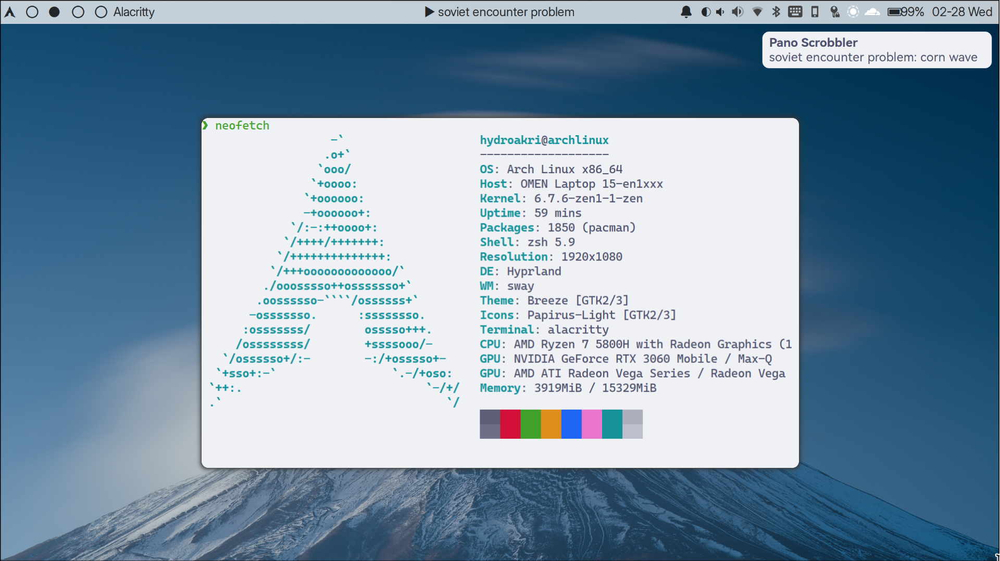

# Easy-to-extend dotfiles with reasonable defaults

I'm a lazy person, I'm often annoyed by the amount of scripts and scattered files that I can find to configure, so I created this repository so that you can apply the programs you want to take effect as you need. I try to make each application or module as easy to copy as possible by default


# Installation

This dotfile is managed by chezmoi

To install from previous installed packages

```
cat installed_flatpak_packages.txt | cut -f1 -d' ' | xargs -n1 flatpak install -y
paru -S --needed - < pkgs.txt
```

Bar: waybar
Theme: Breeze  
LockScreen: hyprlock  
Wallpaper manager: swww  
Icon: papirus-icon-theme  
Cursor: bibata-cursor-theme  
Font: Inter Display, HarmonyOS Sans/Zhuque Fangsong(CJK font)

## pywal config file

I use `pywal` to change theme, so if you dont want use it, you need do some modify(edit words like `colorxx` to your color code) to below config  
wezterm, waybar(its css), mako, wofi, zellij

## waybar:

Nerd Font: to display icons properly  
nwgbar: (optional) the on-click event of custom button, you can change to your command.  
Inter Display: (optional) you can choose your favorite font  
hyprland: (optional) the second left module of the bar, you can change if you not use hyprland  
mpris: (optional) the center module of the bar

pulseaudio module: left click for pavucontrol, right click for mute, scroll to change volume  
battery module: left click for `chgwllpr.sh` to switch wallpaper(via swww) and theme(via pywal)  
clock module: scroll for switch workspace for hyprland.

## scripts:

some script i use, put under `~/script`
`autostart.sh`: use `parallel` to start serval commands when hyprland start(my npm service, syncthing, aria2, password manager)  
`gamemode.sh`: disable keyboard rate in hyprland to prevent input lag  
`bemenu`: just like its name  
`chgwllpr.sh`: change wallpaper and lockscreen paper  
`chtheme.sh`: use pywal to change theme of mako, zellij, wezterm, alacritty. The day/night theme shift methmod depends on `Adw-gtk3`

# license

all files and scripts in this repo are released [CC0](https://creativecommons.org/publicdomain/zero/1.0/) in the spirit of _freedom of information_, i encourage you to fork, modify, change, share, or do whatever you like with this project! `^c^v`
